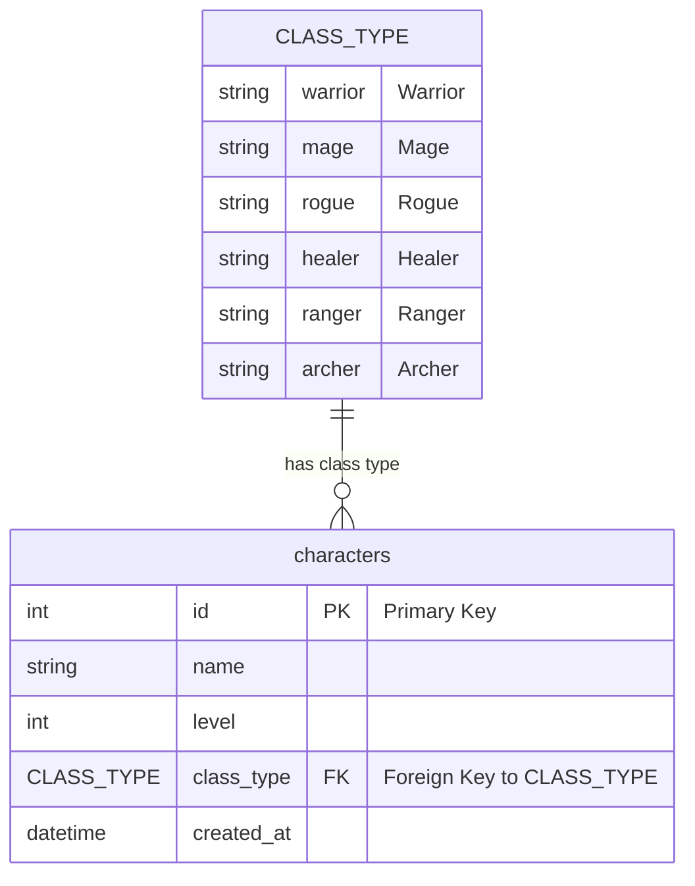

# Game Catalog API

A RESTful API built with **FastAPI** for managing a game character and loadout catalog. This project includes database integration using **SQLAlchemy** and **MySQL**, automated testing with **pytest**, environment variable configuration via `.env`, and Docker support for containerization.

---

## 📁 Project Structure & 🗂️ Module Descriptions

### `app/`

Main application directory.

- **`main.py`**: Entry point of the FastAPI app. Initializes routes and sets up the API.
- **`db.py`**: Configures the SQLAlchemy database engine and session using environment variables. Uses `.env` for secure credential management.
- **`__init__.py`**: Marks the directory as a Python package.

### `app/models/`

Contains SQLAlchemy models for database representation.

- **`character.py`**: Defines the `Character` model and the `ClassType` enum for character roles.
- **`loadout.py`**: Defines the `Loadout` model, representing equipment assigned to a character.

### `app/routes/`

Holds the route definitions and business logic.

- **`character_routes.py`**: Provides endpoints to create, list, and fetch characters.
- **`loadout_routes.py`**: Provides endpoints to manage loadouts related to characters.

### `app/schemas/`

Defines the Pydantic schemas for request and response validation.

- **`character.py`**: Pydantic models for character input (`CharacterCreate`) and output (`CharacterOut`).
- **`loadout.py`**: Pydantic models for loadout input and output.

### `tests/`

Contains test cases using `pytest` and `httpx`.

- **`test_characters.py`**: Tests character creation and listing functionality.
- **`test_loadouts.py`**: Tests creation and retrieval of loadouts.

---

## ⚙️ Configuration Files

- **`.env`**: Stores environment variables like database credentials.
- **`requirements.txt`**: Lists required Python dependencies.
- **`Dockerfile`**: Defines the Docker image for the application.
- **`docker-compose.yml`**: Sets up services (e.g., app, MySQL database) for local development.

---

## Data Model

```

## 🧪 Running Tests

```bash
pytest --cov=app --cov-report=html
```

## Alembic Database Migrations

Once alembic-dev container is running, to apply revisions to databases related to models and schemas run:

```bash
docker-compose exec alembic-dev alembic revision --autogenerate -m "<your-message-regarding-changes>"

```


```bash
docker-compose exec alembic-dev alembic upgrade head
```
