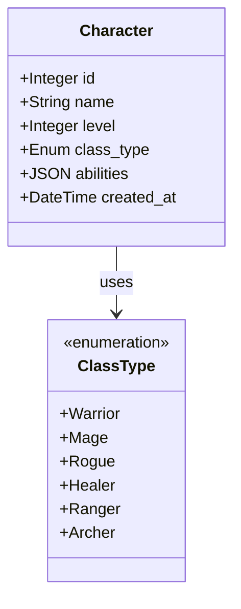
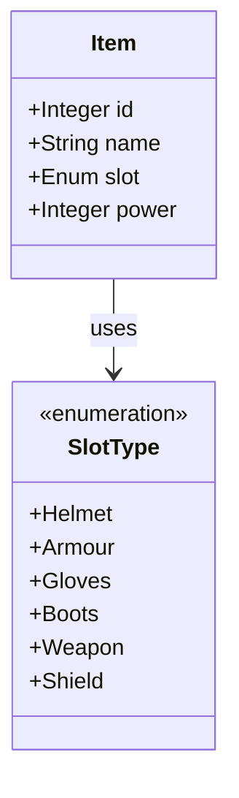

# Game Catalog API

A RESTful API built with **FastAPI** for managing **character** and **item** catalogs in a game system. This backend leverages **SQLAlchemy** for ORM-based data modeling, **MySQL** for relational data storage, and **Alembic** for version-controlled database migrations. The project supports **environment-based configuration** via `.env` files and provides full **Docker support** for seamless containerization and deployment. Automated testing is integrated using **pytest** and runs in a dedicated test container using a separate in-memory test MySQL database for isolated and repeatable test execution.

## Microservice Architecture

This repository is structured following a **Microservice architecture**, which is a common design choice for **scalable MMORPG (Massively Multiplayer Online Role-Playing Game)** platforms. By decoupling the **character** and **item** services, each domain can be developed, deployed, and scaled independently. For example, as user load grows, character management may require more frequent updates and querying, enabling targeted scaling of the character service without affecting other parts of the system. This includes **better separation of concerns**, making it easier to manage and extend functionality (e.g., adding a combat service or inventory system), also a failure in one service (e.g., the item service) does not necessarily crash the entire game backend, along with **independent development teams**, allowing parallel feature development across services like questing, PvP matchmaking, or economy/trade systems.

---

## 📁 Project Structure & 🗂️ Module Descriptions

### `app/`

Main application directory.

- **`main.py`**: Entry point of the FastAPI app. Initializes routes and sets up the API.
- **`db.py`**: Configures the SQLAlchemy database engine and session using environment variables. Uses `.env` for secure credential management.
- **`__init__.py`**: Marks the directory as a Python package.
- **`config.py`**: environment variable configuration.

#### `app/models/`

Contains SQLAlchemy models for database representation.

- **`characters.py`**: Defines the `Character` model and the `ClassType` enum for character roles.
- **`items.py`**: Defines the `Item` model, representing equipment assigned to a character.

#### `app/routes/`

Holds the route definitions.

- **`character_routes.py`**: Provides endpoints to create, list, and fetch characters.
- **`item_routes.py`**: Provides endpoints to manage items found in-game.

#### `app/schemas/`

Defines the Pydantic schemas for request and response validation.

- **`character.py`**: Pydantic models for character input (`CharacterCreate`) and output (`CharacterOut`).
- **`item.py`**: Similar Pydantic models for item input and output.

#### `app/controllers/`

Seperating business logic (simple crud operations) for routes in our controllers:

- **`character_controller.py`**: Provides crud methods to manage characters.
- **`item_controller.py`**: Provides crud methods to manage items.

#### `app/exceptions/`

custom exceptions for crud operations

- **`http_exceptions.py`**: Handles 400,401,403,404,409,500 HTTP responses.

#### `app/utils/`

- utility functions.

### `tests/`

Contains test cases using `pytest` and `httpx`.

- **`test_characters.py`**: Tests character creation and listing functionality.
- **`test_loadouts.py`**: Tests creation and retrieval of loadouts.
- **`conftest.py`**: testing suite database configuration
- **`config.py`**: testing environment variable configuration.

---

## ⚙️ Configuration Files

- **`.env` and `env.test`**: Stores environment variables like database credentials for dev and test.
- **`requirements.txt`**: Lists required Python dependencies.
- **`Dockerfile`**: Defines the Docker image for the application.
- **`docker-compose.yml`**: Sets up services (e.g., app, MySQL database) for local development.

---

## Data Model
Below are Entity-Relationshio_diagrams generated using Mermaid:




## 🧪 Running Tests

```bash
pytest --cov=app --cov-report=html
```

## Swagger API Specification

After running docker and successfully starting your contaners, you can head to `http://localhost:8000/docs` for API specification.

## Alembic Database Migrations

Once alembic-dev container is running, to apply revisions to databases related to models and schemas run:

```bash
docker-compose exec alembic-dev alembic revision --autogenerate -m "<your-message-regarding-changes>"

```


```bash
docker-compose exec alembic-dev alembic upgrade head
```
